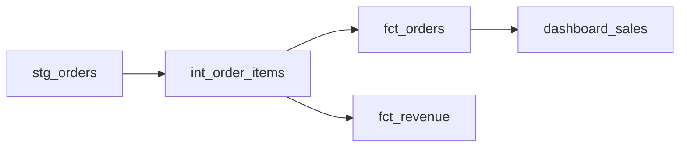

# CLAUDE.md — DataCI

> **"The missing CI layer for analytics engineering."**

DataCI is a GitHub Action that turns every dbt PR into a fully analyzed, risk-aware, and cost-aware report. It combines **impact analysis**, **AI-powered review**, **query cost estimation**, **lineage snapshots**, and **test coverage reporting** into a single PR comment.

---

## Product Vision

### Core Value Proposition

Every dbt PR reviewer asks 5 questions — and currently guesses the answers:

| Question | DataCI Module |
|----------|---------------|
| "What will this change break?" | **Impact Analyzer** |
| "Is this change well-written and safe?" | **AI Reviewer** (Claude) |
| "How expensive is this change?" | **Cost Estimator** |
| "Where does this sit in the pipeline?" | **Lineage Snapshot** |
| "Are we testing this properly?" | **Coverage Reporter** |

DataCI answers all 5 in one PR comment.

### Target Users

- Analytics engineers using **dbt Core** on GitHub (underserved by dbt Cloud's paywalled CI)
- Data teams wanting software-engineering discipline without vendor lock-in
- Platform/data engineering leads enforcing quality gates

---

## Competitive Landscape (April 2026)

### What Exists Today

| Category | Key Players | GitHub Action? | PR Comments? | AI? | Gap |
|----------|------------|---------------|-------------|-----|-----|
| Run dbt in CI | dbt-action (72 stars), dbt Cloud | Yes | No | No | Saturated but basic |
| Impact Analysis | Atlan, Sifflet | Yes | Yes | No | **Requires vendor lock-in ($$$)** |
| Cost Estimation | dbt Cloud UI only | **No** | **No** | No | **Wide open** |
| Test Coverage | dbt-coverage (232 stars), dbt-meta-testing (130 stars) | **No** (CLI only) | **No** | No | **Wide open** |
| SQL Linting | SQLFluff (9.6k stars), Sqruff (1.3k stars) | Yes | Yes (reviewdog) | No | Covered but fragmented |
| AI Code Review | Qodo PR-Agent (10.7k stars), CodeRabbit | Yes | Yes | Yes | **Zero data-domain awareness** |
| Lineage in PRs | Recce (448 stars), Datafold (3k stars) | Partial | Yes (Recce) | No | Exists but complex/expensive |
| dbt Best Practices | dbt-project-evaluator (547 stars), dbt-checkpoint (737 stars) | Partial | **No** | No | Poor PR UX |

### DataCI's Whitespace

1. **No AI-native dbt PR reviewer exists** — general tools (CodeRabbit, Qodo) have zero awareness of dbt patterns, data contracts, or warehouse costs
2. **Query cost estimation in PRs is completely absent** — nobody posts "This PR increases spend by $X/day"
3. **Test coverage diff in PRs does not exist** — no tool posts "Coverage dropped from 85% to 78%"
4. **No single tool combines all 5 signals** — you'd need 5+ tools stitched together today
5. **dbt Core users are underserved** — advanced CI features are locked behind dbt Cloud ($100/seat/month)

### Key Competitors to Watch

- **Recce** — closest to a holistic dbt PR review tool (lineage + data diffs), building AI agents
- **AltimateAI/altimate-code** (452 stars) — open-source CLI with 100+ tools for SQL analysis, column lineage, FinOps; not a GitHub Action yet
- **Elementary** (2.3k stars) — dbt-native observability, post-deploy (not pre-merge)
- **Datafold** — data-diff is OSS, but lineage/BI features require paid cloud

---

## Architecture

### Stack

- **Language**: Python 3.11+
- **Action type**: Docker container action (for reproducibility)
- **AI**: Anthropic Claude API (`claude-sonnet-4-6` for cost efficiency in CI)
- **dbt integration**: Parse `manifest.json`, `catalog.json`, `run_results.json`
- **Warehouse SDKs**: BigQuery (`google-cloud-bigquery`), Snowflake (`snowflake-connector-python`), Databricks (future)
- **GitHub API**: `PyGithub` or raw REST for PR comments

### Repo Structure

```
dataci/
├── action.yml                    # GitHub Action metadata
├── Dockerfile                    # Container action
├── requirements.txt
├── CLAUDE.md                     # This file
├── README.md                     # Marketplace listing / docs
├── LICENSE                       # MIT
├── src/
│   ├── __init__.py
│   ├── main.py                   # Entry point — orchestrates all modules
│   ├── config.py                 # Action inputs → config object
│   ├── dbt/
│   │   ├── __init__.py
│   │   ├── manifest.py           # Parse manifest.json (models, tests, sources)
│   │   ├── lineage.py            # Build DAG, trace upstream/downstream
│   │   ├── coverage.py           # Calculate test coverage metrics
│   │   └── changes.py            # Detect changed models from git diff
│   ├── cost/
│   │   ├── __init__.py
│   │   ├── estimator.py          # Base cost estimation logic
│   │   ├── bigquery.py           # BigQuery dry-run cost estimation
│   │   └── snowflake.py          # Snowflake credit estimation
│   ├── review/
│   │   ├── __init__.py
│   │   ├── ai_reviewer.py        # Claude-powered SQL/dbt review
│   │   └── prompts.py            # Review prompt templates
│   ├── report/
│   │   ├── __init__.py
│   │   ├── composer.py           # Combine all module outputs into one report
│   │   ├── templates/            # Markdown/HTML templates for PR comment
│   │   └── github.py             # Post/update PR comment via GitHub API
│   └── utils/
│       ├── __init__.py
│       ├── git.py                # Git diff helpers
│       └── logging.py            # Structured logging
├── tests/
│   ├── __init__.py
│   ├── fixtures/                 # Sample manifest.json, catalog.json, etc.
│   ├── test_manifest.py
│   ├── test_lineage.py
│   ├── test_coverage.py
│   ├── test_changes.py
│   ├── test_cost_estimator.py
│   ├── test_ai_reviewer.py
│   └── test_composer.py
└── examples/
    └── workflow.yml              # Example GitHub Actions workflow
```

### How It Works (Runtime Flow)

```
PR opened/updated
    │
    ▼
1. Detect changed files (git diff)
    │
    ▼
2. Parse dbt manifest.json (from artifact or dbt compile)
    │
    ▼
3. Run modules in parallel:
    ├── Impact Analyzer → downstream models/sources affected
    ├── Coverage Reporter → test coverage % and delta
    ├── Cost Estimator → estimated query cost (BigQuery dry-run / Snowflake explain)
    ├── AI Reviewer → Claude analyzes SQL changes for issues
    └── Lineage Snapshot → Mermaid diagram of affected DAG slice
    │
    ▼
4. Compose single PR comment (Markdown)
    │
    ▼
5. Post/update comment on PR via GitHub API
```

### Example PR Comment Output (Target UX)

```markdown
## DataCI Report

### Impact Analysis
- **6 downstream models** affected by changes to `stg_orders`
- **2 dashboards** depend on affected models
- Risk Level: **HIGH**

### Test Coverage
| Metric | Before | After | Delta |
|--------|--------|-------|-------|
| Models tested | 42/50 (84%) | 42/53 (79%) | -5% |
| New models without tests | — | 3 | |

### Cost Estimate (BigQuery)
| Model | Before | After | Delta |
|-------|--------|-------|-------|
| `fct_orders` | 2.1 GB | 8.4 GB | +$0.02/run |
| `dim_customers` | 0.5 GB | 0.5 GB | — |

### Lineage


### AI Review
- Join on `stg_orders` x `stg_products` may cause row explosion (no unique key constraint)
- Missing `not_null` test on `order_id` in new model
- Consider incremental materialization for `fct_orders` (currently table, 8.4 GB scan)

---
*Powered by [DataCI](https://github.com/marketplace/actions/dataci) — CI/CD for analytics engineering*
```

---

## Build & Release Strategy

**Approach**: Ship as a GitHub Action from day one. Publish to Marketplace after Phase 1 MVP, then release each new phase as a version update. Users get improvements automatically.

### Phase 1: MVP → Publish to Marketplace (v1.0)

**Goal**: Ship a working GitHub Action, publish to GitHub Marketplace immediately.

**Features**:
- Detect changed dbt models from git diff
- Parse `manifest.json` to build dependency graph
- Impact analysis: list downstream models affected by changes
- Test coverage: report % of models with tests, flag new models without tests
- Compose and post a single Markdown PR comment

**Inputs** (action.yml):
- `manifest-path` — path to dbt `manifest.json`
- `github-token` — for posting PR comments

**No warehouse connection needed. No AI. Pure static analysis of dbt artifacts.**

**Marketplace publishing checklist**:
- [ ] `action.yml` with proper branding (icon, color)
- [ ] README.md with usage examples, screenshots of PR comment
- [ ] LICENSE (MIT)
- [ ] Create public GitHub repo
- [ ] Tag `v1.0.0` release
- [ ] Publish via repo Settings → "Publish this Action to the GitHub Marketplace"

### Phase 2: AI Reviewer (v1.1)

**Goal**: Add Claude-powered SQL review to the PR comment. Push as Marketplace update.

**Features**:
- Send changed SQL files + dbt context to Claude API
- Review for: bad joins, missing tests, naming conventions, performance anti-patterns
- Append AI review section to PR comment

**New inputs**:
- `anthropic-api-key` — for Claude API
- `ai-review-enabled` — toggle (default: true)

### Phase 3: Cost Estimation (v1.2)

**Goal**: Estimate query cost changes and surface them in the PR comment.

**Features**:
- BigQuery: use `dry_run` flag to get bytes processed, convert to cost
- Snowflake: use `EXPLAIN` plan to estimate credits
- Show before/after cost comparison per changed model

**New inputs**:
- `warehouse-type` — `bigquery` | `snowflake`
- `warehouse-credentials` — service account JSON or Snowflake creds (via GitHub secrets)

### Phase 4: Lineage Visualization (v1.3)

**Goal**: Generate a visual lineage graph in the PR comment.

**Features**:
- Build Mermaid diagram from dbt DAG (affected subgraph only)
- Embed in PR comment (GitHub renders Mermaid natively)
- Highlight changed nodes vs downstream affected nodes

**No new inputs — uses manifest.json from Phase 1.**

### Phase 5: Monetization (v2.0)

**Goal**: Introduce free + paid tiers on GitHub Marketplace.

**Free tier**:
- Impact analysis
- Test coverage
- Lineage snapshot
- Basic AI review (limited to 5 files per PR)

**Paid tier** (via license key or GitHub Marketplace billing):
- Full AI review (unlimited files)
- Cost estimation (warehouse connection)
- Custom rules / thresholds
- Slack/Teams notifications
- Historical trend tracking

---

## Development Commands

```bash
# Navigate to project
cd "/Users/mac/Documents/BrainStorm Projects/dataci"

# Set up virtual environment
python -m venv venv && source venv/bin/activate

# Install dependencies
pip install -r requirements.txt

# Run tests
pytest tests/ -v

# Run locally (simulate action)
python -m src.main --manifest-path ./tests/fixtures/manifest.json

# Build Docker image
docker build -t dataci .

# Test Docker action locally
docker run --rm -v $(pwd):/workspace dataci
```

---

## Key Design Decisions

1. **Docker container action** (not JavaScript) — Python ecosystem has the best dbt/warehouse libraries
2. **Claude Sonnet for CI** (not Opus) — cost-efficient for automated runs, fast enough for PR feedback
3. **Static analysis first** — Phase 1 needs zero credentials (just manifest.json), maximizing adoption
4. **Single PR comment** — update one comment (not spam multiple), use collapsible sections for detail
5. **Mermaid for lineage** — GitHub renders it natively, no image hosting needed
6. **dbt Core first** — serve the underserved, expand to dbt Cloud later

---

## Naming & Positioning

- **Name**: DataCI
- **Tagline**: "CI/CD for analytics engineering"
- **Marketplace category**: Code quality / Testing
- **Alternative names considered**: ModelGuard, dbtGuard, LineageCI
- **Positioning**: "Bring software engineering discipline to your data stack"
